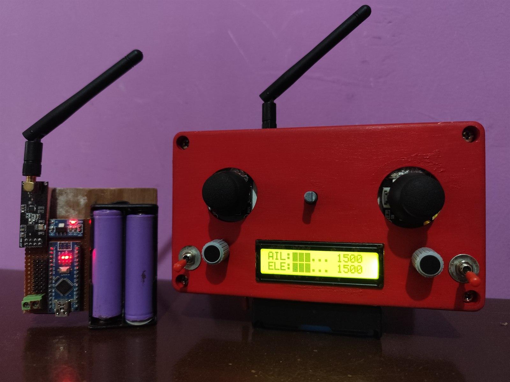
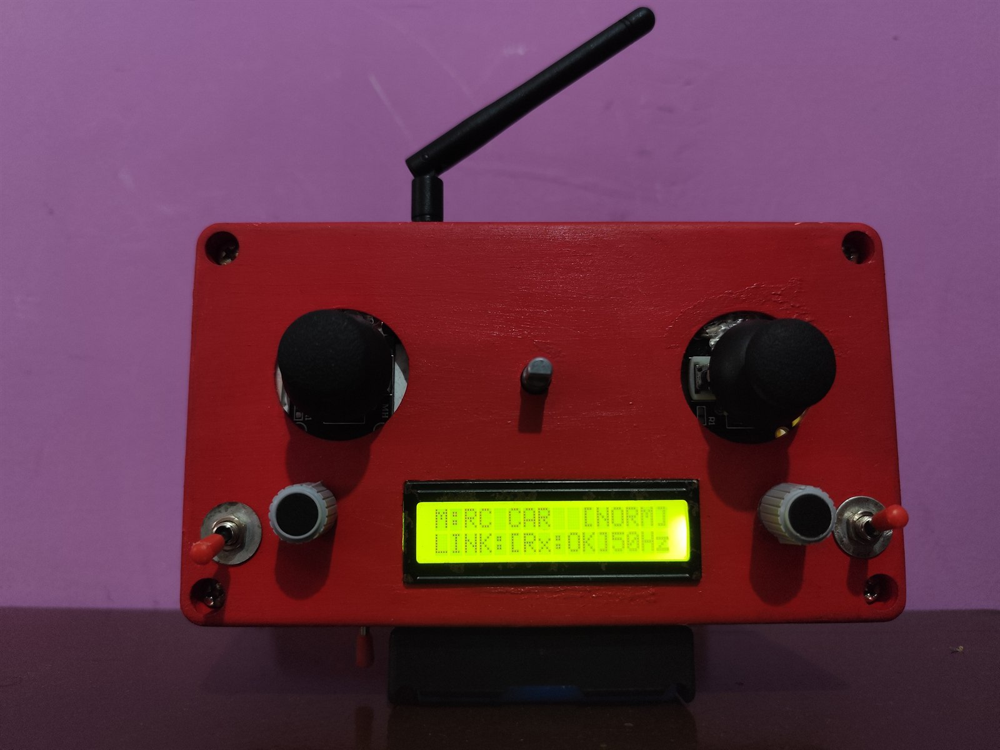
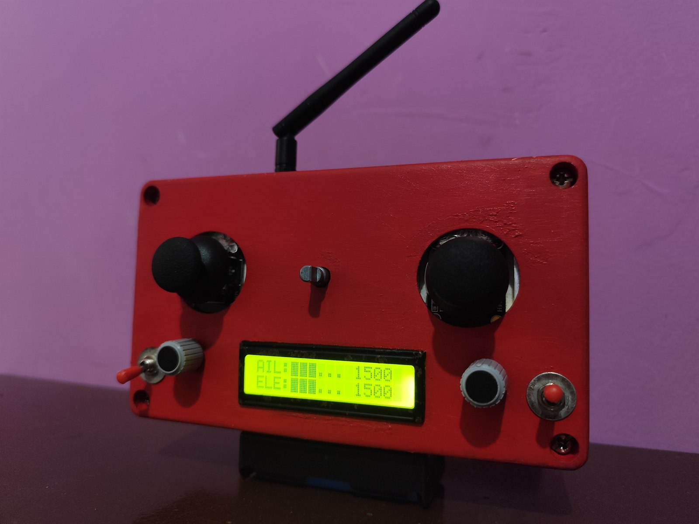
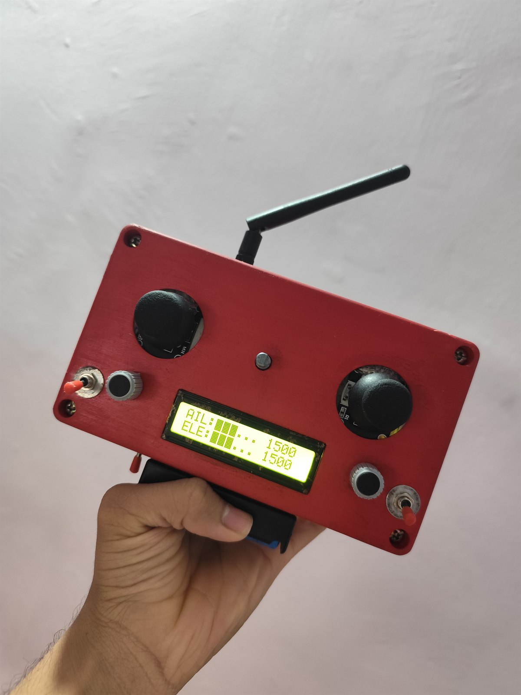
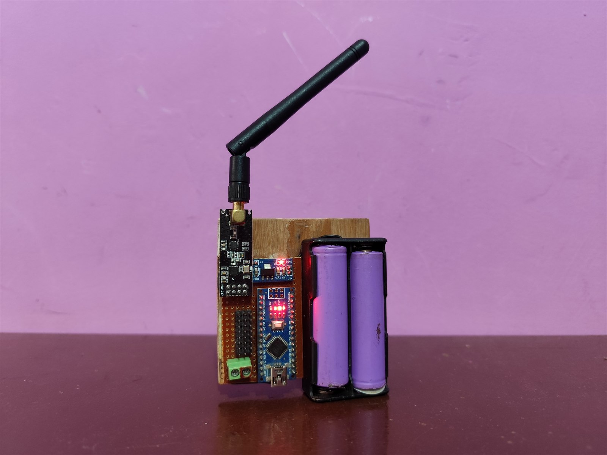
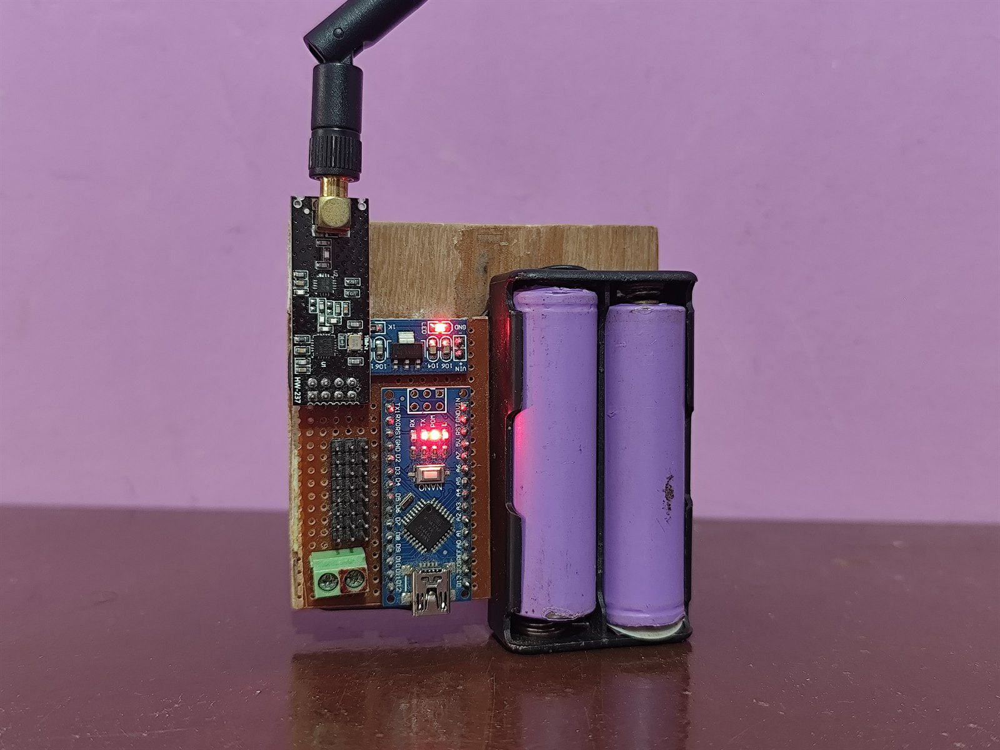
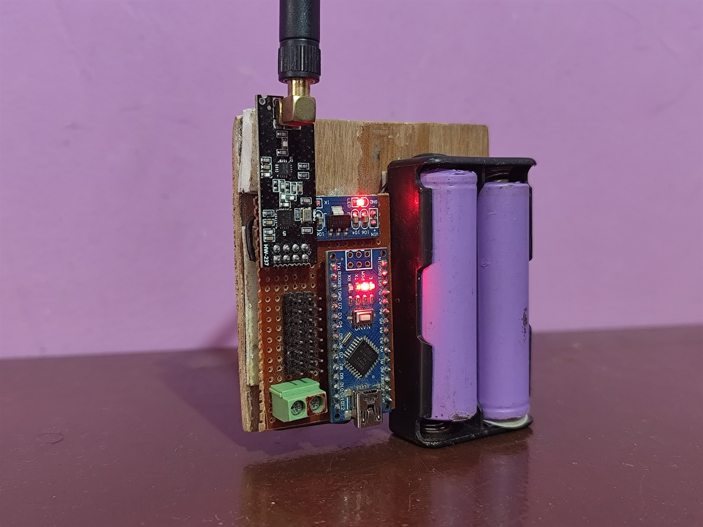

# 🎮 8-Channel Professional RC Transmitter & Receiver System

[](https://github.com/Maker-Yash/Arduino-8Channel-RC-Transmitter-Receiver/actions)
[](LICENSE)
[](https://www.arduino.cc/)
[](https://isocpp.org/)
[](#hardware-requirements)
[](#4-multi-vehicle-model-profiles)

An advanced 8-channel RC Transmitter (TX) and Receiver (RX) system inspired by professional radios (FlySky FS-i6X / OpenTX / RadioMaster). Engineered for ultra-low latency, robust RF stability, and high performance on standard **Arduino Nano (ATmega328P)** microcontrollers.

<p align="center">
  
  <br>
  <em>Figure 1: Complete 8-Channel Arduino RC Transmitter (TX) and Receiver (RX) System in Operation</em>
</p>

---

## 📸 Hardware Showcase & Gallery

### 🎮 Transmitter (TX) Unit
<p align="center">
  
  
</p>
<p align="center">
  
  <br>
  <em>Figure 2: Custom Red Enclosure with Gimbals, Dual AUX Pots, Switches, Rotary Menu Navigation & 16x2 I2C Real-Time Channel Bar Graph UI</em>
</p>

### 📡 Receiver (RX) Unit
<p align="center">
  
  
  
  <br>
  <em>Figure 3: Compact Receiver Unit with High-Gain NRF24L01+ PA/LNA Antenna, 2S 18650 Battery Pack, 8 Servo Channel Rails & Status LED</em>
</p>

---

## 🌟 Key Highlights & Features

- **⚡ Fast 400kHz I2C & 33 FPS Refresh**: Fluid graphic slider bars and real-time responsiveness on a 16x2 I2C LCD.
- **🔄 Interrupt-Driven Rotary Encoder**: Gray-code state machine with hardware interrupts (`INT0`/`INT1`) and digital debounce.
- **🚀 4 Generic Model Memory Profiles**: Stored in EEPROM (`MODEL 1` to `MODEL 4`) with independent trims, endpoints, dual rates, expo curves, wing mixes, deadbands, and custom names.
- **✏️ Onboard Model Customization**: Interactive character-by-character model renaming and channel deadband adjustment right on the transmitter.
- **🎯 Dual Rates (D/R) & Exponential (EXPO)**: True cubic polynomial curves for silky-smooth center stick response without losing full throw.
- **🎛️ Wing / Tail Mixing**: Native support for **Normal**, **Elevon / Delta Wing** (CH1 + CH2), and **V-Tail** (CH2 + CH4).
- **🛡️ Failsafe & Jitter Filter**: Automatic throttle cut (1000µs) and neutral channel lock upon signal loss; hysteresis filter eliminates servo buzzing.
- **📡 Bidirectional Telemetry**: Live bi-directional Auto-ACK with `"RX: OK"` connection health monitoring and dedicated status LED on the receiver.
- **💾 Safe RAM Footprint**: EEPROM-paged memory architecture utilizing < 30% SRAM (> 1400 bytes free) for zero-crash operational stability.

---

## 🗂️ Repository Structure

```text
rc_tx_rx_8ch/
├── assets/               # High-resolution hardware and UI photos
│   ├── system_overview.jpg
│   ├── transmitter_front_view.jpg
│   ├── transmitter_telemetry_ui.jpg
│   ├── transmitter_handheld.jpg
│   ├── receiver_overview.jpg
│   ├── receiver_front_angle.jpg
│   └── receiver_closeup.jpg
├── TX_8CH/
│   └── TX_8CH.ino        # 8-Channel Transmitter firmware (PROGMEM UI, EEPROM, Menus)
├── RX_8CH/
│   └── RX_8CH.ino        # 8-Channel Receiver firmware (Servo PWM, Failsafe, LED)
├── .gitignore            # Git ignore file for Arduino build & editor files
├── LICENSE               # MIT Open Source License
└── README.md             # Project documentation & wiring schematics
```

---

## 🧰 Hardware Requirements

### Transmitter (TX) Bill of Materials
- 1x Arduino Nano (ATmega328P, 16MHz, 5V)
- 1x NRF24L01+ Transceiver Module (with PA + LNA & external antenna recommended)
- 1x NRF24L01 3.3V Voltage Regulator Adapter Board (or 10µF–100µF capacitor across 3.3V/GND)
- 1x 16x2 I2C Character LCD Display (PCFL8574 I2C adapter, default address `0x27` or `0x3F`)
- 1x Rotary Encoder (KY-040 or equivalent with push button switch)
- 2x 2-Axis Analog Joysticks (Gimbal sticks with return springs)
- 2x 10kΩ Linear Potentiometers (for AUX 1 & AUX 2)
- 2x Toggle Switches (SPST or SPDT for AUX 3 & AUX 4)
- 1x 2S LiPo (7.4V) or 6x AA Battery Pack + Power Switch

### Receiver (RX) Bill of Materials
- 1x Arduino Nano (ATmega328P, 16MHz, 5V)
- 1x NRF24L01+ Transceiver Module + Adapter Board
- 1x External 5V-6V UBEC / Battery for Servos & Motors
- 1x Status LED + 220Ω Resistor (Connected to Pin A1)
- Standard 3-pin servo headers for 8 output channels

---

## 🔌 Wiring & Pin Assignments

### 1. Transmitter (TX) Pinout — Arduino Nano

| Component | Arduino Nano Pin | Type / Function | Description |
| :--- | :--- | :--- | :--- |
| **Joystick 1 X-Axis** | `A0` | Analog Input | Channel 1 (Aileron / Steering / Roll) |
| **Joystick 1 Y-Axis** | `A1` | Analog Input | Channel 2 (Elevator / Pitch) |
| **Joystick 2 Y-Axis** | `A2` | Analog Input | Channel 3 (Throttle / Forward-Reverse) |
| **Joystick 2 X-Axis** | `A3` | Analog Input | Channel 4 (Rudder / Yaw) |
| **Potentiometer 1** | `A6` | Analog Input | Channel 5 (AUX 1 / Pot 1) — 0% to 100% |
| **Potentiometer 2** | `A7` | Analog Input | Channel 6 (AUX 2 / Pot 2) — 0% to 100% |
| **Toggle Switch 1** | `D5` | Digital Input | Channel 7 (AUX 3 / Switch 1) — `INPUT_PULLUP` |
| **Toggle Switch 2** | `D6` | Digital Input | Channel 8 (AUX 4 / Switch 2) — `INPUT_PULLUP` |
| **Rotary Encoder CLK** | `D2` | Interrupt 0 | Rotary Encoder Phase A (`INPUT_PULLUP`) |
| **Rotary Encoder DT** | `D3` | Interrupt 1 | Rotary Encoder Phase B (`INPUT_PULLUP`) |
| **Rotary Encoder SW** | `D4` | Digital Input | Encoder Push Button (`INPUT_PULLUP`) |
| **I2C LCD SDA** | `A4` | I2C Data | 400kHz Fast I2C Bus |
| **I2C LCD SCL** | `A5` | I2C Clock | 400kHz Fast I2C Bus |
| **NRF24L01 CE** | `D9` | Digital Output | Chip Enable |
| **NRF24L01 CSN** | `D10` | Digital Output | SPI Chip Select |
| **NRF24L01 MOSI** | `D11` | Hardware SPI | Master Out Slave In |
| **NRF24L01 MISO** | `D12` | Hardware SPI | Master In Slave Out |
| **NRF24L01 SCK** | `D13` | Hardware SPI | SPI Clock |
| **NRF24L01 Power** | `3.3V` & `GND` | Power | Use dedicated adapter or 10µF cap |
| **LCD & Nano Power** | `5V` & `GND` | Power | Regulated 5V source |

---

### 2. Receiver (RX) Pinout — Arduino Nano

| Channel / Function | Arduino Nano Pin | Device Connection | Signal Range |
| :--- | :--- | :--- | :--- |
| **CH1 Output** | `A0` | Aileron / Steering Servo | Standard 1000–2000µs 50Hz PWM |
| **CH2 Output** | `D2` | Elevator / Pitch Servo | Standard 1000–2000µs 50Hz PWM |
| **CH3 Output** | `D3` | ESC / Throttle Motor Controller | Auto-Cut to 1000µs on Failsafe |
| **CH4 Output** | `D4` | Rudder / Yaw Servo | Standard 1000–2000µs 50Hz PWM |
| **CH5 Output** | `D5` | AUX 1 / Gimbal / Pan Servo | Standard 1000–2000µs 50Hz PWM |
| **CH6 Output** | `D6` | AUX 2 / Flaps / Pan-Tilt | Standard 1000–2000µs 50Hz PWM |
| **CH7 Output** | `D7` | AUX 3 / Gear / Relay Switch | Low (1000µs) / High (2000µs) |
| **CH8 Output** | `D8` | AUX 4 / Arm Switch / Buzzer | Low (1000µs) / High (2000µs) |
| **Status LED** | `A1` | Connection Indicator LED | Solid = Connected, Blinking = Failsafe |
| **NRF24L01 CE** | `D9` | Chip Enable | RF Transceiver Control |
| **NRF24L01 CSN** | `D10` | SPI Chip Select | RF Transceiver Control |
| **NRF24L01 MOSI** | `D11` | Hardware SPI MOSI | SPI Data |
| **NRF24L01 MISO** | `D12` | Hardware SPI MISO | SPI Data |
| **NRF24L01 SCK** | `D13` | Hardware SPI SCK | SPI Clock |
| **Servo Power** | External UBEC | Servo VCC / GND Rails | **Connect External GND to Nano GND!** |

> [!IMPORTANT]
> **Common Ground**: Always connect the GND pin of the external servo power supply / battery to the Arduino Nano GND pin. Without a common ground reference, servos will experience erratic jitter.

---

## 🗃️ 4 Generic Model Profiles & Onboard Memory

The transmitter features 4 independent generic model memory banks saved directly into EEPROM:

| Slot | Default Name | User Customizable | Mix Mode Options | Default Settings |
| :---: | :--- | :---: | :---: | :--- |
| **1** | **`MODEL 1`** | ✅ Yes (Onboard Name Editor) | `NORMAL`, `ELEVON`, `V-TAIL` | 100% Rates, 0% Expo, Neutral Trims, Standard Deadbands |
| **2** | **`MODEL 2`** | ✅ Yes (Onboard Name Editor) | `NORMAL`, `ELEVON`, `V-TAIL` | 100% Rates, 0% Expo, Neutral Trims, Standard Deadbands |
| **3** | **`MODEL 3`** | ✅ Yes (Onboard Name Editor) | `NORMAL`, `ELEVON`, `V-TAIL` | 100% Rates, 0% Expo, Neutral Trims, Standard Deadbands |
| **4** | **`MODEL 4`** | ✅ Yes (Onboard Name Editor) | `NORMAL`, `ELEVON`, `V-TAIL` | 100% Rates, 0% Expo, Neutral Trims, Standard Deadbands |

---

## 🕹️ Menu System & Navigation

### Entering & Using the Menu
- **Enter Settings**: Long-press the Rotary Encoder button for **1.8 seconds**.
- **Scroll Items**: Rotate the knob clockwise or counter-clockwise.
- **Select / Enter**: Short-click the encoder button.
- **Adjust Values**: Rotate knob to increment / decrement numbers or cycle characters.
- **Save / Exit**: Short-click to confirm, or scroll to **`12. SAVE & EXIT`** (or hold encoder button for 1.8s).

### 12-Item Pro Menu Structure
1. **`1. DIGITAL TRIM`**: Fine neutral adjustment (-150µs to +150µs) for CH1..CH4 with live feedback.
2. **`2. D/R & EXPO`**: Configurable rates (50% to 100%) and exponential smoothing curves (0% to 70%).
3. **`3. ENDPOINTS`**: Independent travel limits (800µs to 2200µs) for all 8 channels.
4. **`4. REVERSE CH`**: Invert output direction for any channel (CH1 to CH8).
5. **`5. CALIBRATION`**: Safe step-by-step stick & potentiometer calibration wizard.
6. **`6. WING MIXING`**: Select `NORMAL`, `ELEVON` (Delta Wing), or `V-TAIL`.
7. **`7. MODEL SELECT`**: Switch active profile (`MODEL 1`, `MODEL 2`, `MODEL 3`, `MODEL 4`).
8. **`8. MODEL NAME`**: Interactive character-by-character on-screen model renaming tool.
9. **`9. DEADBAND SET`**: Tweak center deadband window (0 to 30 ADC units) on CH1..CH4 to eliminate jitter.
10. **`10. SET FAILSAFE`**: Capture current stick positions as custom receiver failsafe settings.
11. **`11. RESET MODEL`**: Restore active model profile to generic baseline defaults.
12. **`12. SAVE & EXIT`**: Commit all RAM changes to EEPROM and return to home screen.

---

## 📦 Required Arduino Libraries

Install these via the **Arduino IDE Library Manager** (`Sketch` -> `Include Library` -> `Manage Libraries...`):

1. **`RF24`** by *TMRh20* (v1.4.0 or newer)
2. **`LiquidCrystal_I2C`** by *Frank de Brabander / Marco Schwartz*
3. **`Servo`** (Standard Arduino built-in library)

---

## 🚀 Getting Started & Flashing

1. **Clone or Download the Repository**:
   ```bash
   git clone https://github.com/Maker-Yash/Arduino-8Channel-RC-Transmitter-Receiver.git
   ```
2. **Flash the Transmitter (TX)**:
   - Open `TX_8CH/TX_8CH.ino` in the Arduino IDE.
   - Select Board: **Arduino Nano**, Processor: **ATmega328P** (or *ATmega328P Old Bootloader* depending on your board).
   - Click **Upload**.
3. **Flash the Receiver (RX)**:
   - Open `RX_8CH/RX_8CH.ino` in the Arduino IDE.
   - Select Board: **Arduino Nano**, select the RX COM port, and click **Upload**.
4. **Power Up & Calibrate**:
   - Power on the Transmitter.
   - Long press the encoder button (2s) -> go to **`5. CALIBRATION`** -> follow on-screen instructions to move all sticks and pots through their full range.
   - Power on the Receiver: the status LED on `A1` will turn **Solid ON** and the TX screen will show **`RX: OK`**.

---

## 📄 License

This project is licensed under the **MIT License** - see the [LICENSE](LICENSE) file for details.

---

## 🤝 Contributing

Contributions, bug reports, and feature suggestions are welcome! Feel free to open an **Issue** or submit a **Pull Request**.
